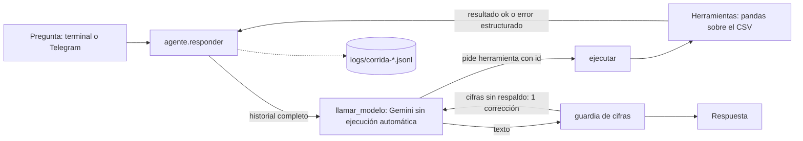

# Agente analista del DENUE · Tampico y Ciudad Madero

- **Alumno:** COMPLETAR
- **Número de control:** COMPLETAR
- **Asignatura:** Desarrollo de Agentes Inteligentes (ACD-2504), grupo 850P-A
- **Docente:** D. C. C. Alejandro Estrada Padilla
- **Trabajo:** Proyecto · Unidad 1
- **Entrega:** 30 de septiembre de 2026

## Qué hace y por qué es un agente

Responde en español preguntas sobre los 22,900 establecimientos del DENUE de Tampico y Ciudad Madero (cuántas farmacias hay en un municipio, en qué colonia se concentra un giro, qué empresas grandes hay) con cifras exactas. El modelo de lenguaje (Gemini) nunca ve los datos: el archivo pesa 4.9 MB y un modelo no cuenta filas con exactitud. El modelo **percibe** la pregunta y los resultados, **decide** qué herramienta pedir y con qué argumentos, y el código **actúa**: ejecuta la herramienta con pandas y le devuelve el resultado. El ciclo lo controla nuestro código, no el SDK, con un presupuesto de 5 llamadas al modelo y 6 herramientas por pregunta. Antes de mostrar la respuesta, una guardia revisa que cada cifra venga de una herramienta.

## Los datos

INEGI, *Directorio Estadístico Nacional de Unidades Económicas* (DENUE), edición 05/2026, recortado a Tampico (15,716 establecimientos) y Ciudad Madero (7,184), sin razón social, teléfono, correo ni página web. Columnas principales: `nombre`, `codigo_act` (clase SCIAN de 6 dígitos), `actividad`, `sector`, `estrato` (personal ocupado en 7 rangos), `municipio` y `colonia`. Los datos **no** tienen el número exacto de empleados, ventas, ingresos, ganancias, salarios ni opiniones, y los nombres de colonia tienen variantes capturadas a mano (CENTRO, ZONA CENTRO...).

## Arquitectura



## Herramientas

| Herramienta | Recibe | Devuelve | Cuándo la usa el modelo |
|---|---|---|---|
| `buscar_actividades` | `texto` | Hasta 15 clases SCIAN `{codigo_act, actividad, establecimientos}` | Antes de contar un giro, para conocer sus códigos |
| `contar` | Filtros | `total` de establecimientos | Preguntas de "¿cuántos...?" |
| `ranking` | `por`, `top` (1–20), filtros menos colonia | `filas` `{valor, total}` de mayor a menor, `total_filtrado` | Comparar municipios, colonias, sectores, clases o estratos |
| `listar` | `limite` (1–20), al menos un filtro | `establecimientos` del estrato mayor al menor, `total`, `mostrados` | Nombres de establecimientos concretos |

Filtros comunes (se aplican a la vez): `municipio`, `codigo_act` (varios códigos separados por coma, cada uno como prefijo), `sector`, `estrato` y `colonia`. Un argumento inválido devuelve `{"ok": false, "error": ..., "valores_validos": [...]}`.

## Requisitos e instalación

Python 3.11 o superior.

```bash
git clone COMPLETAR_URL_DEL_REPOSITORIO
cd agente-denue-COMPLETAR
python -m venv .venv
.venv\Scripts\activate          # Windows  (macOS/Linux: source .venv/bin/activate)
pip install -r requirements.txt
copy .env.example .env          # Windows  (macOS/Linux: cp .env.example .env)
```

## Variables de entorno

| Variable | Contenido |
|---|---|
| `GEMINI_API_KEY` | Clave de Google AI Studio |
| `GEMINI_MODEL` | Modelo de Gemini (`gemini-3.6-flash`) |
| `TELEGRAM_BOT_TOKEN` | Token del bot que entrega @BotFather |
| `TELEGRAM_USUARIOS_PERMITIDOS` | Identificadores numéricos de Telegram autorizados, separados por coma |

`.env` está en `.gitignore` y **no se sube**; en el repositorio sólo está `.env.example`, vacío.

## Cómo usarlo

```bash
python -m app.cli "¿Cuántas farmacias hay en Tampico?" --simulado   # simulada, sin cuota
python -m app.cli "¿Cuántas farmacias hay en Tampico?"              # modelo real
python -m app.lote --simulado
python -m app.lote --desde P01 --hasta P05                           # modelo real
python -m pruebas.prueba_herramientas
python -m evaluacion.calcular_esperadas
python -m app.evaluar logs/corrida-A.jsonl logs/corrida-B.jsonl
```

## Bot de Telegram

1. En Telegram, abra @BotFather (cuenta oficial, palomita azul), envíe `/newbot` y elija un nombre y un usuario que termine en `bot`.
2. Copie el token **sólo** en `TELEGRAM_BOT_TOKEN` del archivo `.env`. Si se filtra, use `/revoke` en BotFather.
3. Corra el bot y escríbale: como aún no está autorizado, responde que es privado y muestra su identificador. Agréguelo a `TELEGRAM_USUARIOS_PERMITIDOS` y reinicie el bot. Con la lista vacía no atiende a nadie.
4. `python -m app.bot --simulado` (sin cuota) o `python -m app.bot` (modelo real).

Comandos: `/start` (qué puede y qué no puede responder, que puede tardar, aviso de privacidad) y `/fuente`. Cualquier otro texto se responde con el mismo `agente.responder` de la terminal, en otro hilo para no congelar el bot.


## Estructura del proyecto

```
app/herramientas.py        normalizar, cargar_datos, las 4 herramientas y DECLARACIONES
app/modelo.py              la única función que habla con Gemini
app/modelo_simulado.py     guion fijo de 4 pasos para desarrollar sin cuota
app/agente.py              ejecutar() y responder(): el ciclo
app/guardia.py             numeros, numeros_en, cifras_sin_respaldo
app/comun.py               rutas, carga de datos y bitácora compartidas por cli, lote y bot
app/cli.py                 una pregunta desde la terminal
app/lote.py                el banco de preguntas
app/evaluar.py             compara con las esperadas
app/bot.py                 bot de Telegram: sólo recibe y entrega mensajes
prompts/sistema.md         instrucciones de sistema
pruebas/prueba_herramientas.py   pruebas sin red
evaluacion/calcular_esperadas.py pandas directo, sin el agente
evaluacion/esperadas.json  respuestas esperadas (commit antes de la corrida real)
evaluacion/resultados.json, analisis.md
data/                      datos del docente, sin modificar
logs/                      bitácoras de las corridas
evidencia/telegram.png     captura de una conversación con el bot
traza_manual.md            traza a mano (Parte E)
```

## Decisiones de diseño

- **Límites:** 5 llamadas al modelo y 6 herramientas por pregunta. En el último turno, o al agotar las herramientas, se llama con `mode="NONE"` para obligar al modelo a redactar.
- **`codigo_act`:** texto con uno o varios códigos separados por coma; cada uno filtra como prefijo (`startswith`). Así el modelo pide un total de varias clases en una sola llamada en lugar de sumar.
- **Guardia:** toda cifra de la respuesta debe estar en la pregunta o en los resultados de las herramientas. Si no, se da **una** corrección, que consume un turno; si persiste, la respuesta se muestra con un aviso. Una sola corrección evita gastar el presupuesto en un ciclo de correcciones.
- **Sin código del modelo:** el modelo sólo puede pedir una de las 4 herramientas fijas; `ejecutar` rechaza cualquier otro nombre o argumento con un error estructurado y el programa no usa `eval` ni `exec`. La ejecución automática del SDK está desactivada.
- **Colonias:** coincidencia exacta normalizada; si no hay filas, se sugieren hasta 10 colonias que contienen el texto entre las que cumplen los demás filtros.

## Resultados

COMPLETAR: cinco renglones con los números de `evaluacion/analisis.md` (aprobadas automáticas y manuales, llamadas totales, casos analizados).

## Límites y ética

El agente no puede responder sobre número exacto de empleados, ventas, ganancias, salarios, opiniones ni municipios fuera del recorte; lo dice en lugar de inventar. Usa datos públicos del INEGI bajo sus Términos de Libre Uso, y cada respuesta cita la fuente. Los datos no contienen información personal (se retiraron teléfono, correo y razón social). Los mensajes del bot pasan por Telegram y Google, por eso `/start` pide no escribir datos personales; la bitácora guarda sólo un hash del usuario, nunca su identificador ni su nombre.

## Declaración de uso de IA

COMPLETAR: qué herramienta usó, para qué parte y qué tuvo que corregirle o verificar.
